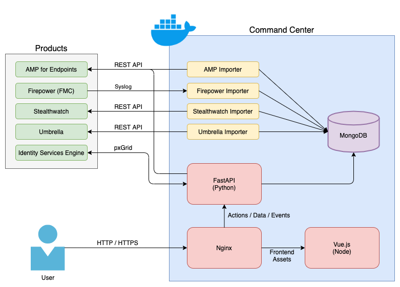

# Cisco Command Center

Cisco Command Center is a project to collect and correlate event data across multiple Cisco Security (and possibly third-party) products, and display that data in an easy to understand interface.  The end goal is to allow Security Analysts to easily identify attacks and the offending hosts, and perform remediations against those attacks - all from a single web application.


## Requirements

* Must have Docker installed
* Must have Docker Compose installed

## Installation

Cisco Command Center uses a Python Flask web server, a MongoDB database, a Vue javascript framework front-end, and several "worker" Docker containers to import events.  The current architecture for the project is shown below.



To set up Command Center, first, make a copy of *.example.env* file as *.env*.  From the project root directory, run the following:

>```cp .example.env .env```

You'll then need to enter the MongoDB database credentials you'd prefer to use, and product API credentials, into the *.env* file.  API credentials are not required for each product, but each will product will provide it's own set of event data and response capabilities.

By default, Command Center will deploy a MongoDB container, and leverage that for storage.  If you'd like to use an external MongoDB instance, simply update the MongoDB address, database name, and credentials in the *.env* file.

Once the *.env* file configuration is complete, you can simply run the following command from the root project directory to start all of the Docker containers:

>```docker-compose up```

This will download/compile all of the containers, and start them.  By default, this will run the containers in the foreground.  I recommend doing this at least once to make sure everything starts appropriately.  Once you've verified the *.env* is correct, you can run the following to daemon-ize the containers:

>```docker-compose up -d```

At this point your Command Center instance should be up and running on port 5000.

## Features

Command Center currently has the capability to import event data and information from the following products:

* Cisco AMP for Endpoints
* Cisco Firepower Management Center
* Cisco Identity Services Engine
* Cisco Stealthwatch Enterprise
* Cisco Umbrella

Event data from these products is easily filtered by Time, Product, Event Name, or Source IP in order to discover potentially malicious hosts.

If malicious activity is discovered, Command Center allows the user to leverage the following remediation actions:

* Apply an Adaptive Network Control (ANC) policy to a host through Identity Services Engine
* Apply Endpoint Isolation to a host through AMP for Endpoints
* Change the group/policy membership of a computer in AMP for Endpoints 

## To-Do

* Import Duo events
* Import Stealthwatch Cloud events
* Import Firepower Device events (rather than strictly from FMC)
* Display Stealthwatch Host Snapshot data
* Federate event loads across multiple MongoDB files to improve performance

## Issues

If you run into a bug, please submit it using the GitHub Issues page.

## Contributing

Feedback, thoughts, ideas, and code contributions are welcome!
